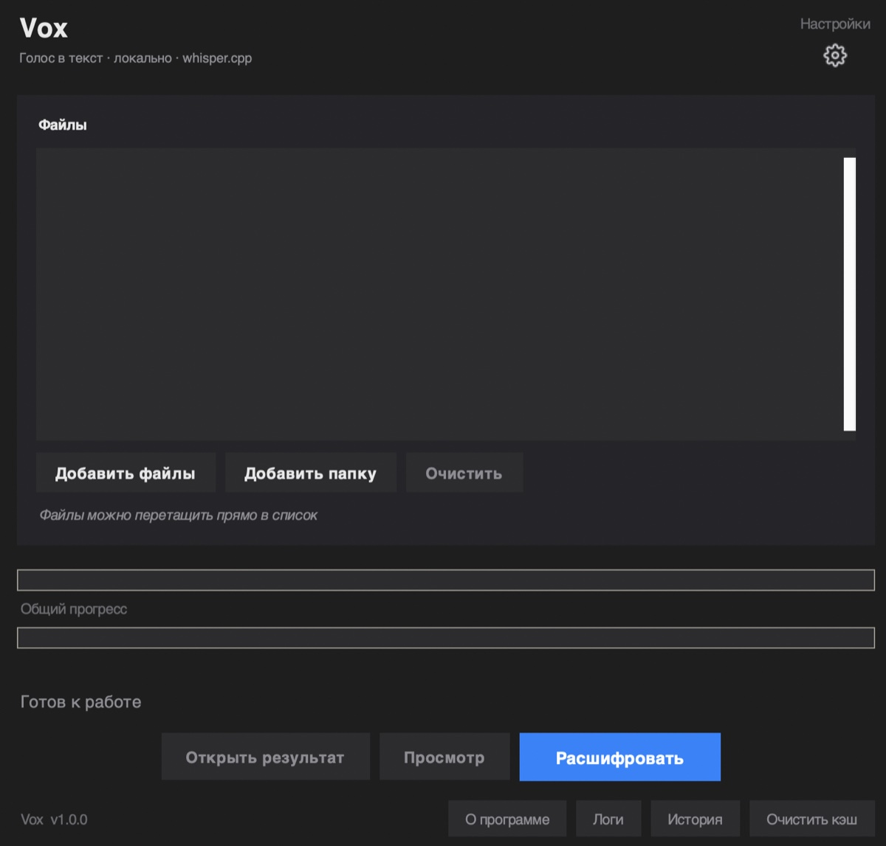
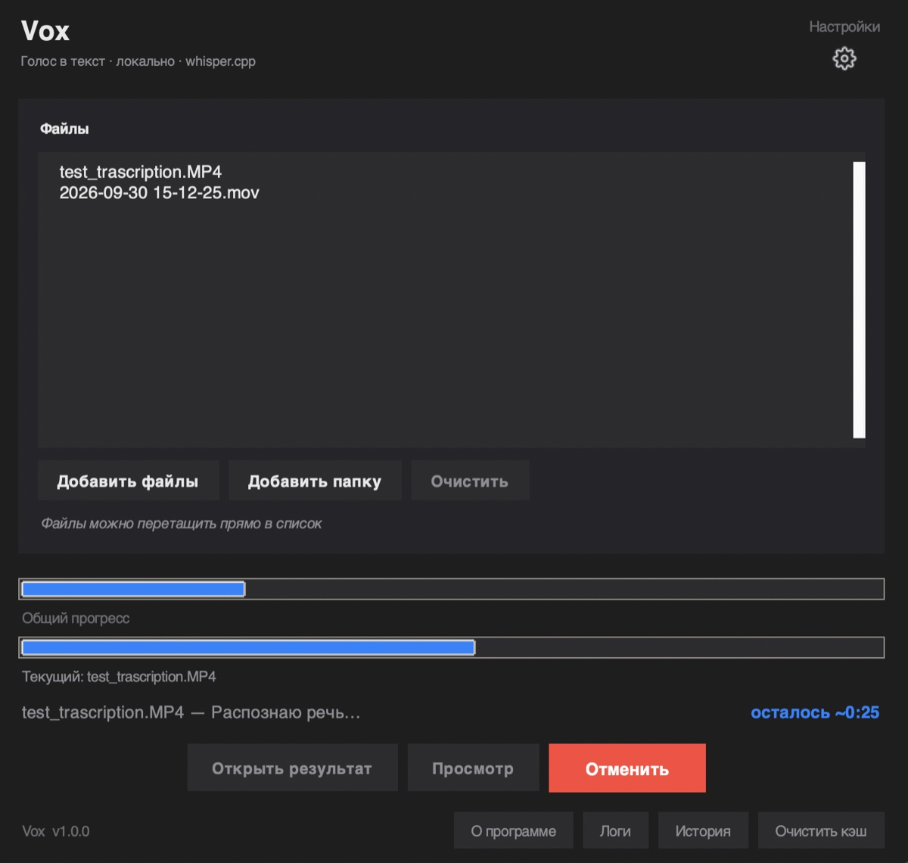
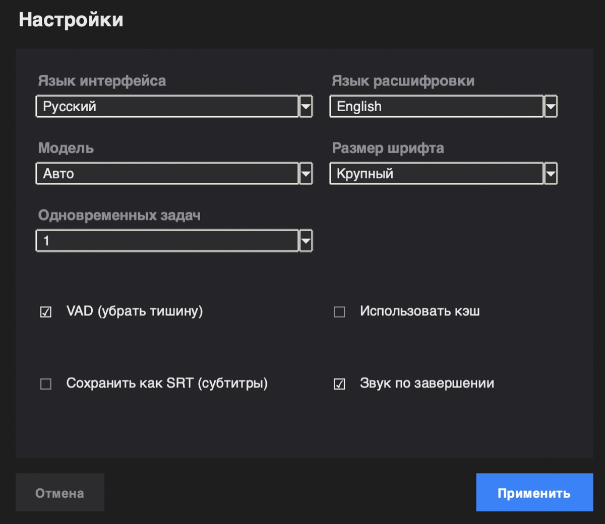
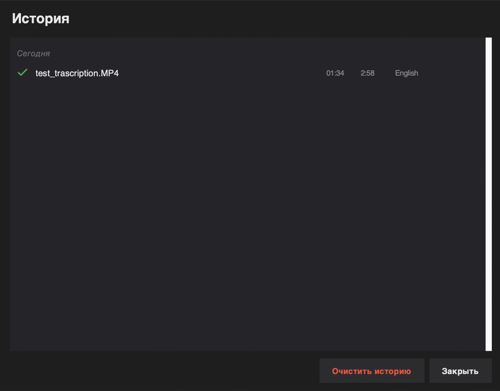

# Vox

**Local audio and video transcription for macOS.**
No cloud, no subscriptions, no data leaks.

[Features](#features) ·
[Requirements](#requirements) ·
[Installation](#installation) ·
[Usage](#usage) ·
[Development](#development) ·
[Known limitations](#known-limitations)

---

## About

Vox is a desktop app for macOS that turns speech into text entirely on
your machine. No API keys, no cloud uploads, no subscriptions.

Under the hood it uses [whisper.cpp](https://github.com/ggerganov/whisper.cpp)
on Apple Silicon. Transcription runs 5-15x faster than real time on
M1/M2/M3/M4 chips.

## Features

| | |
|---|---|
| Audio and video input | MP4, MOV, MKV, MP3, WAV, M4A and more |
| 99 languages | Automatic detection or manual selection |
| Fully local | Files never leave your Mac |
| VAD | Removes silence, reduces Whisper hallucinations |
| SRT subtitles | Saved next to the plain-text output |
| Batch processing | 1-4 parallel jobs |
| Cache | Repeat transcription of the same file is instant |
| Drag and drop | Drop files straight into the list |
| 12 interface languages | EN, RU, ES, ZH, HI, AR, PT, DE, JA, FR, PL, SR |
| History | Every transcription kept with its result |
| Auto-update | Checks for a new version on launch |

## Requirements

- macOS 11 (Big Sur) or newer
- Apple Silicon (M1/M2/M3/M4). Intel works but slower
- 8 GB RAM or more
- About 2 GB of free disk space for the Whisper model

## Installation

### Prebuilt app

Download the latest `.app` from the
[Releases](https://github.com/Hewako/vox/releases) page, unzip and drag
`Vox.app` into Applications.

The first launch may trigger a Gatekeeper warning about an unidentified
developer. Open **System Settings - Privacy & Security** and click
**Open Anyway**. This is a one-time step.

### From source

Homebrew and Python 3.11+ required.

    # 1. Dependencies
    brew install whisper-cpp ffmpeg

    # 2. Clone
    git clone https://github.com/Hewako/vox.git
    cd vox

    # 3. Virtual environment
    python3 -m venv .venv
    source .venv/bin/activate
    pip install -r requirements.txt

    # 4. Build the .app
    python3 setup.py py2app

The finished app ends up in `/Applications/Vox.app`.

## Usage

1. Add files with the button or drag them into the list
2. Configure language, model, VAD and SRT in the settings window
3. Click Transcribe. Multiple files are queued automatically
4. Collect the result: a `.txt` next to the source file, plus `.srt` if enabled

### Where things live

| Item | Path |
|------|------|
| Whisper models | `~/whisper-models/` |
| Transcription cache | `~/.whisper_cache/` (500 MB cap) |
| Settings | `~/Library/Application Support/Vox/settings.json` |
| History | `~/Library/Application Support/Vox/history.json` |
| Logs | `~/Library/Logs/Vox.log` (rotation: 1 MB x 5 files) |

If a transcription fails, Vox shows a short error code like `E021`.
See [ERROR_CODES.md](ERROR_CODES.md) for the full reference and what to do about each one.

The cache is cleaned automatically when it exceeds the cap. Use the
**Clear cache** button in the footer to empty it on demand.

### Keyboard shortcuts

| Key | Action |
|-----|--------|
| `Esc` | Cancel the current transcription |
| `Enter` | Apply changes in the settings window |
| `Esc` | Close the settings window without saving |

## Development

### Environment

    python3 -m venv .venv
    source .venv/bin/activate
    pip install -r requirements.txt

### Tests

    pytest tests/ -v

98 tests covering core/updater, core/settings, core/models, core/cache,
core/history, core/errors and core/utils.

### Project layout

    vox/
    ├── core/           business logic: transcription, cache, history, updates
    ├── ui/             interface: windows, dialogs, widgets
    ├── tests/          pytest suite
    ├── scripts/        helper scripts
    ├── assets/         icons and resources
    ├── docs/           documentation and screenshots
    ├── config.py       constants, paths, palette
    ├── i18n.py         translations (12 languages)
    └── main.py         entry point

### Build

    python3 setup.py py2app

The script copies the built `.app` to `/Applications/` and cleans up
`build/` and `dist/`.

## Tech stack

- [whisper.cpp](https://github.com/ggerganov/whisper.cpp) - speech recognition engine
- [ffmpeg](https://ffmpeg.org/) - audio extraction from video
- [Python 3.11+](https://www.python.org/) + tkinter - user interface
- [Pillow](https://python-pillow.org/) - image handling
- [py2app](https://py2app.readthedocs.io/) - application bundling
- [pytest](https://pytest.org/) - testing
- [rlottie-python](https://github.com/laggykiller/rlottie-python) - settings icon animation

## Known limitations

- **macOS only.** The app relies on system APIs (`open`, `NSApplication`,
  `xattr`) that do not map cleanly to Linux or Windows.
- **No diarization.** All speakers appear in one stream. Speaker separation
  is on the roadmap.
- **Not notarized.** Gatekeeper shows a warning on first launch.
- **Models downloaded from HuggingFace.** The first run needs internet.

## Contributing

Issues and pull requests are welcome. For larger changes, please open a
[discussion](https://github.com/Hewako/vox/issues) first so we can agree
on the approach.

## License

MIT. See [LICENSE](LICENSE).

## Author

Built by [Hewako](https://github.com/Hewako).

If Vox has been useful, consider starring the repository.
